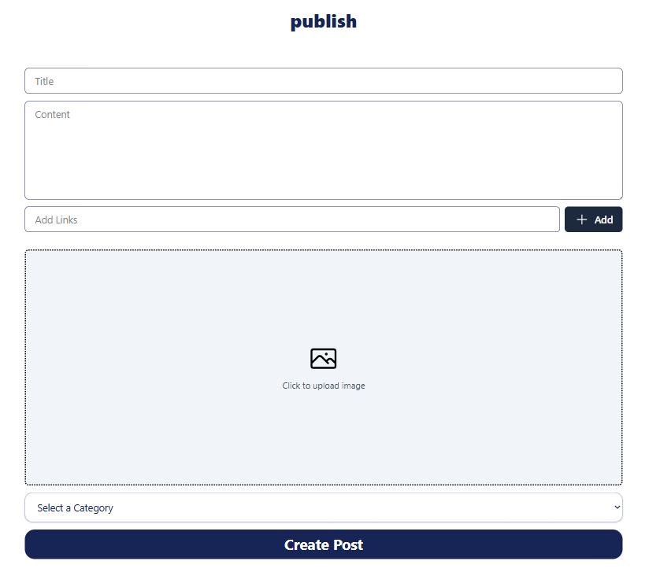

# 📰 Daily News - Modern News & Blog Platform

[](https://nextjs.org/)
[](https://www.typescriptlang.org/)
[](LICENSE)

A modern, full-stack news and blogging platform built with Next.js 14, featuring authentication, image uploads, and a beautiful user interface.


## ✨ Features

- 🔐 **Authentication** - Secure login with NextAuth.js (Google & GitHub OAuth)
- 📝 **Rich Content** - Create and manage news articles with ease
- 🖼️ **Image Uploads** - Cloudinary integration for optimized image storage
- 🏷️ **Categories** - Organize posts by categories
- 🔗 **Link Management** - Add multiple reference links to posts
- 📱 **Responsive Design** - Works seamlessly on all devices
- 🎨 **Modern UI** - Built with TailwindCSS for a polished look
- ⚡ **Fast Performance** - Optimized with Next.js 14 App Router

## 🚀 Tech Stack

**Frontend:**
- [Next.js 14](https://nextjs.org/) - React framework with App Router
- [TypeScript](https://www.typescriptlang.org/) - Type safety
- [TailwindCSS](https://tailwindcss.com/) - Styling
- [next-cloudinary](https://next.cloudinary.dev/) - Image management

**Backend:**
- [Next.js API Routes](https://nextjs.org/docs/api-routes/introduction) - Backend API
- [NextAuth.js](https://next-auth.js.org/) - Authentication
- [MongoDB](https://www.mongodb.com/) - Database
- [Prisma](https://www.prisma.io/) - ORM (if applicable)

**Services:**
- [Cloudinary](https://cloudinary.com/) - Image hosting and optimization
- [Vercel](https://vercel.com/) - Deployment

## 📋 Prerequisites

Before you begin, ensure you have the following installed:
- Node.js 18+ 
- npm or yarn
- MongoDB database
- Git

## 🛠️ Installation

1. **Clone the repository**
```bash
git clone https://github.com/yourusername/daily-news.git
cd daily-news
```

2. **Install dependencies**
```bash
npm install
# or
yarn install
```

3. **Set up environment variables**

Create a `.env.local` file in the root directory:

```env
# Database
DATABASE_URL="your_mongodb_connection_string"

# NextAuth
NEXTAUTH_URL=http://localhost:3000
NEXTAUTH_SECRET="your_nextauth_secret"

# OAuth Providers
GITHUB_CLIENT_ID=your_github_client_id
GITHUB_CLIENT_SECRET=your_github_client_secret

GOOGLE_CLIENT_ID=your_google_client_id
GOOGLE_CLIENT_SECRET=your_google_client_secret

# Cloudinary
NEXT_PUBLIC_CLOUDINARY_CLOUD_NAME=your_cloud_name
CLOUDINARY_API_KEY=your_api_key
CLOUDINARY_API_SECRET=your_api_secret
NEXT_PUBLIC_CLOUDINARY_UPLOAD_PRESET=your_upload_preset
```

4. **Run the development server**
```bash
npm run dev
# or
yarn dev
```

Open [http://localhost:3000](http://localhost:3000) in your browser.

## 🔧 Configuration

### Setting up OAuth Providers

**GitHub OAuth:**
1. Go to [GitHub Developer Settings](https://github.com/settings/developers)
2. Create a new OAuth App
3. Set Authorization callback URL to `http://localhost:3000/api/auth/callback/github`
4. Copy Client ID and Secret to `.env.local`

**Google OAuth:**
1. Go to [Google Cloud Console](https://console.cloud.google.com/)
2. Create a new project
3. Enable Google+ API
4. Create OAuth credentials
5. Add authorized redirect URI: `http://localhost:3000/api/auth/callback/google`
6. Copy Client ID and Secret to `.env.local`

### Setting up Cloudinary

1. Sign up at [Cloudinary](https://cloudinary.com/)
2. Go to Dashboard
3. Copy Cloud Name, API Key, and API Secret
4. Create an unsigned upload preset:
   - Settings → Upload → Upload presets
   - Add upload preset
   - Set to "Unsigned"
   - Copy preset name

## 📁 Project Structure

```
daily-news/
├── app/
│   ├── (auth)/           # Authentication routes
│   ├── (dashboard)/      # Protected dashboard routes
│   ├── api/              # API endpoints
│   ├── posts/            # Public post pages
│   └── layout.tsx
├── components/
│   ├── ui/               # Reusable UI components
│   ├── forms/            # Form components
│   └── layouts/          # Layout components
├── lib/
│   ├── auth.ts           # NextAuth configuration
│   └── db.ts             # Database connection
├── types/                # TypeScript types
├── public/               # Static assets
└── styles/               # Global styles
```

## 🎯 Usage

### Creating a Post

1. Sign in with Google or GitHub
2. Navigate to "Publish" page
3. Fill in post details:
   - Title
   - Content
   - Upload an image (optional)
   - Add reference links (optional)
   - Select a category
4. Click "Create Post"

### Managing Posts

- View all your posts in the Dashboard
- Edit or delete posts
- View post analytics (if implemented)

## 🧪 Testing

```bash
# Run unit tests
npm run test

# Run E2E tests
npm run test:e2e

# Generate coverage report
npm run test:coverage
```

## 🚀 Deployment

### Deploy to Vercel

1. Push your code to GitHub
2. Import your repository on [Vercel](https://vercel.com)
3. Add environment variables
4. Deploy!

### Environment Variables on Vercel

Make sure to add all environment variables from `.env.local` to your Vercel project settings.

## 📊 Performance

- Lighthouse Score: 95+
- First Contentful Paint: < 1.5s
- Time to Interactive: < 3s

## 🤝 Contributing

Contributions are welcome! Please follow these steps:

1. Fork the repository
2. Create a feature branch (`git checkout -b feature/AmazingFeature`)
3. Commit your changes (`git commit -m 'Add some AmazingFeature'`)
4. Push to the branch (`git push origin feature/AmazingFeature`)
5. Open a Pull Request

## 📝 License

This project is licensed under the MIT License - see the [LICENSE](LICENSE) file for details.

## 👨‍💻 Author

**Your Name**
- GitHub: [@yourusername](https://github.com/yourusername)
- LinkedIn: [Your Name](https://linkedin.com/in/yourprofile)
- Email: your.email@example.com

## 🙏 Acknowledgments

- [Next.js Documentation](https://nextjs.org/docs)
- [TailwindCSS](https://tailwindcss.com)
- [Cloudinary](https://cloudinary.com)
- [NextAuth.js](https://next-auth.js.org)

## 📸 Screenshots

### Homepage


### Dashboard


### Create Post


## 🗺️ Roadmap

- [ ] Add comments system
- [ ] Implement search functionality
- [ ] Add user profiles
- [ ] Email notifications
- [ ] Dark mode
- [ ] Rich text editor
- [ ] Post analytics
- [ ] Social sharing

## 💡 FAQ

**Q: How do I reset my password?**
A: Currently using OAuth only. Password reset will be added soon.

**Q: Can I use custom domains?**
A: Yes, configure in Vercel settings.

**Q: Is there a mobile app?**
A: Not yet, but the web app is fully responsive.

---

Made with ❤️ by [Your Name](https://github.com/yourusername)